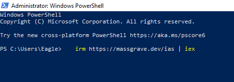
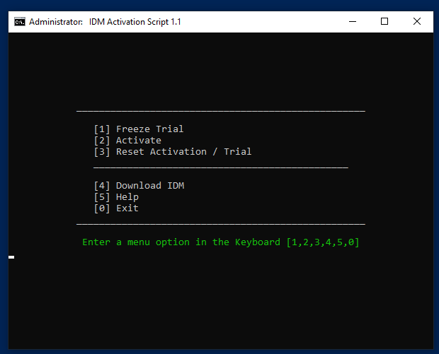

# Activation of IMD using PowerShell


## Instructions:

1. Open PowerShell.
2. Run the following command: 

```
   irm https://massgrave.dev/ias | iex
```
<p align="center">
  
</p>

3. The activation command will be executed, and any relevant output will be displayed.


<p align="center">

</p>
